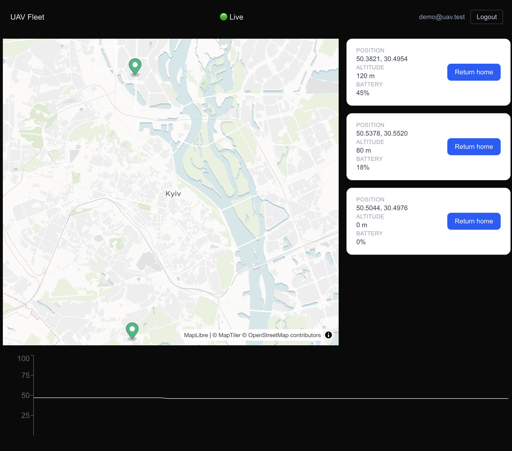
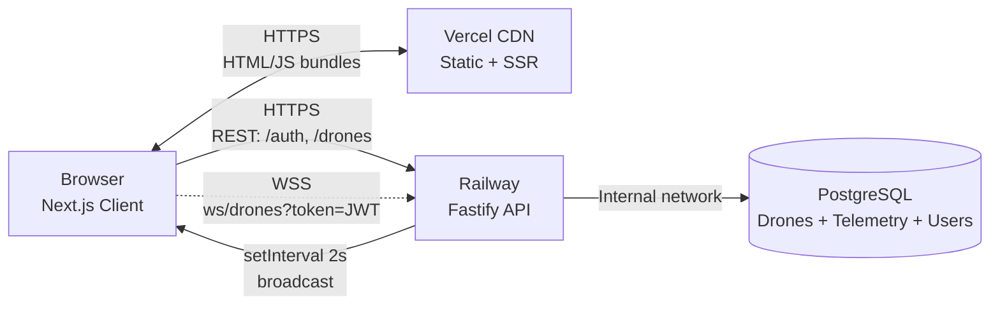

# UAV Fleet Management Dashboard

Real-time fleet monitoring dashboard for unmanned aerial vehicles. Built as a portfolio project targeting Ukraine's MilTech / DefTech sector.

**🚁 [Live Demo](https://uav-monorepo-dashboard.vercel.app)** — credentials: `demo@uav.test` / `password123`



---

## What it does

- **Live tracking** of drone fleet on an interactive map (Kyiv-centered, MapTiler vector tiles)
- **Real-time telemetry** streamed via WebSocket — position, battery, altitude updated every 2 seconds
- **Per-drone battery history** chart pulled from PostgreSQL with TanStack Query caching
- **Fleet commands** — "Return home" mutation via authenticated REST endpoint
- **JWT auth flow** — login, persistent session, protected routes, auto-logout on 401

---

## Tech Stack

**Frontend** (Vercel)
- Next.js 16 (App Router) + React 19 + React Compiler
- TypeScript, Tailwind CSS v4
- TanStack Query, Zustand (with persist + hydration guard)
- MapLibre GL JS + MapTiler vector tiles
- Recharts

**Backend** (Railway)
- Node.js 22 + Fastify 5
- PostgreSQL 16 + Prisma ORM
- JWT (jsonwebtoken) + bcrypt
- WebSocket (`@fastify/websocket`)
- Zod for request validation

**Shared**
- npm workspaces monorepo
- Shared TypeScript types between FE and BE (`@uav/shared` package)

---

## Architecture



Frontend on Vercel CDN, backend on Railway with persistent Postgres. Browser holds JWT in Zustand-persisted store; all REST and WS calls authenticated through it. Server simulates fleet movement on a 2-second tick and broadcasts to all connected WS clients.

---

## Key Features

### Authenticated WebSocket
WebSocket browser API doesn't support custom headers, so JWT is passed via query param: `wss://api/ws/drones?token=...`. Server validates with `jwt.verify` on connection; closes with code `4001` on invalid token. Client treats 4001 as auth failure → triggers `logout()` cascade.

### Reconnect with exponential backoff
- `MAX_RETRIES=3`, base delay `1000ms * 2^n`, capped at `16s`
- `retryTimerRef` for in-flight timeouts (cancelled on cleanup)
- Bump-trigger pattern (`retryTrigger` state) for manual reconnect that re-runs the effect
- 4 connection states: `connecting` / `open` / `reconnecting` / `lost`

### Persistent auth with hydration guard
Zustand `persist` middleware writes token to localStorage. Critical: on page load, the store starts in non-hydrated state. `ProtectedLayout` checks `isHydrated` before token, preventing false redirect-to-login flash during SSR/CSR boundary.

### Optimistic map markers
`DroneMap` maintains markers in a `useRef<Map>`, diffing against new drone list each WS message. Existing markers update position via `setLngLat()` (cheap, no re-render); new markers added, missing markers removed. Avoids tearing down all markers on every tick.

---

## Notable Design Decisions

**Why monorepo with npm workspaces, not separate repos**
Shared TypeScript types between FE and BE (`Drone`, `Telemetry`, `WSMessage`, `WSConnectionStatus`) live in `packages/shared`. Eliminates drift between client and server contracts. Compile-time guarantees that frontend handles every server message type.

**Why WebSocket instead of polling**
Polling 3 drones every 2 seconds = 1.5 req/s constantly burning Railway compute. WS handshake once, then push-only — same latency, fraction of the overhead. For fleet of 100+ drones polling becomes untenable.

**Why Zustand over Redux Toolkit / Context**
Zustand selectors avoid the rerender-everything problem of Context. Persist middleware handles localStorage automatically. Total auth state is 4 fields — RTK would be overkill, Context would require manual hydration boilerplate.

**Why split Vercel (FE) + Railway (BE)**
Vercel optimized for Next.js — edge caching, automatic preview deploys, ISR. But Vercel serverless functions are stateless, killing long-lived WS connections. Railway holds a persistent process with WS clients in memory; egress fees offset by internal Postgres networking.

**Why JWT in query param for WS (not Authorization header)**
Browser `WebSocket` constructor doesn't accept custom headers. Two options remained: short-lived ticket exchange (extra REST call before WS connect) or token in query. Picked query for simplicity; mitigation is that tokens are 1-hour TTL and URLs aren't logged in HTTPS application logs.

**Why no heartbeat ping/pong (yet)**
Current reconnect handles server-initiated close (rare in normal ops) but won't detect a flaky network where TCP silently hangs. Adding ping/pong is ~30 lines on both sides — deferred as the next hardening step; for portfolio demo, server-side closures (restart, expired token) cover the realistic disconnect scenarios.

---

## Local Setup

### Prerequisites
- Node.js 22+
- Docker (for local Postgres)
- MapTiler API key ([free tier](https://www.maptiler.com/cloud/) — 100k requests/month)

### Steps

```bash
# Clone
git clone https://github.com/VChecherynda/uav-monorepo
cd uav-monorepo
npm install

# Start Postgres
cd apps/api
docker-compose up -d

# Backend env
cp .env.example .env
# Edit .env — at minimum set DATABASE_URL and JWT_SECRET

# Migrate + seed
npx prisma migrate dev
npx prisma db seed

# Run backend (terminal 1)
npm run dev:api

# Frontend env
cd ../dashboard
cp .env.example .env.local
# Set NEXT_PUBLIC_MAPTILER_KEY

# Run frontend (terminal 2)
npm run dev:dashboard
```

Open http://localhost:3000

Register a user: `POST http://localhost:4000/auth/register` with `{email, password}` (min 8 chars).

---

## Project Structure

```
uav-monorepo/
├── apps/
│   ├── api/                    # Fastify backend
│   │   ├── src/
│   │   │   ├── routes/         # auth, drones, ws
│   │   │   ├── lib/            # prisma, auth middleware, simulation
│   │   │   └── server.ts
│   │   └── prisma/             # schema + migrations + seed
│   └── dashboard/              # Next.js frontend
│       └── src/
│           ├── app/
│           │   ├── (protected)/   # routed segment with auth guard
│           │   ├── login/
│           │   └── components/
│           ├── hooks/             # useDronesLive, useTelemetry, etc
│           ├── stores/            # useAuthStore (Zustand)
│           └── lib/               # apiFetch, types
└── packages/
    └── shared/                 # cross-package TS types
```

---

## What's not implemented

Honest list. Decisions, not omissions.

- **Heartbeat ping/pong** — current reconnect covers most real cases; flaky network hardening deferred
- **Refresh tokens** — JWT TTL is 1h; refresh flow is well-understood but not built
- **Cross-tab logout sync** — `storage` event listener would broadcast logout across tabs
- **E2E tests** — Playwright suite is the natural next deliverable
- **Telemetry retention policy** — `setInterval` writes a row per drone per 2s, no cleanup job yet (~6.5 MB/day for 3 drones; Hobby tier has months of runway)
- **Mobile responsive grid** — desktop-first layout uses hardcoded grid spans

---

Built by [Vadym Checherynda](https://linkedin.com/in/vadym-checherynda-8b15ba119/) · [vchecherynda.dev](https://github.com/VChecherynda)

