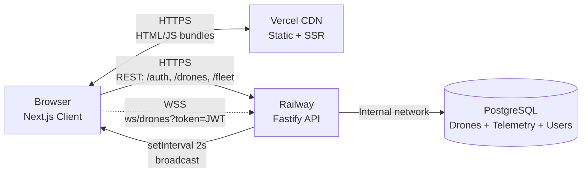

# UAV Fleet Management Dashboard

Ground Control Station prototype demonstrating real-time UAV fleet awareness for operators managing drone assets in the field.

Built as a portfolio project targeting Ukraine's MilTech/DefTech sector — the focus is on frontend architecture decisions that scale: WebSocket resilience, domain-driven bounded contexts, and optimistic command handling with saga compensation.

**🚁 [Live Demo](https://uav-monorepo-dashboard.vercel.app)** — credentials: `demo@uav.test` / `password123`


---

## Architecture



### Why Vercel + Railway split

Vercel is optimized for Next.js — edge caching, automatic preview deploys. But Vercel serverless functions are stateless and short-lived — they kill long-lived WebSocket connections. Railway runs a persistent Node.js process that holds WebSocket clients in memory. Postgres on Railway internal network means zero egress fees between API and DB.

### Frontend Bounded Contexts

Domain logic is organized as bounded contexts following DDD principles — each context owns its domain, exposes a public interface via `index.ts`, and knows nothing about other contexts' internals:

| Context                   | Responsibility                                                    |
| ------------------------- | ----------------------------------------------------------------- |
| `contexts/drones`         | Real-time drone state, map visualization, WS lifecycle management |
| `contexts/fleet-commands` | Per-drone commands, optimistic updates, saga                      |
| `contexts/fleet`          | Fleet-level operations (reset all)                                |
| `contexts/notifications`  | Domain events, toast system                                       |
| `contexts/auth`           | JWT session, hydration guard                                      |
| `contexts/telemetry`      | Battery history, chart                                            |

DDD on the frontend is justified here by domain complexity — optimistic updates with rollback, saga with timeout, WebSocket reconnect logic, and domain events that affect multiple UI areas. A flat `components/` folder would become an unmaintainable dependency graph within weeks.

---

## Key Technical Decisions

### WebSocket Resilience

Browser `WebSocket` API doesn't support custom headers — JWT is passed via query param: `wss://api/ws/drones?token=...`. Server validates with `jwt.verify` on connection, closes with code `4001` on invalid token. Client treats `4001` as auth failure → triggers `logout()` cascade, no reconnect attempt.

For network failures, three mechanisms work in layers:

1. **Exponential backoff reconnect** — delays double on each attempt (`1s → 2s → 4s`), capped at `16s`, max 3 retries before `lost` state
2. **Heartbeat keepalive** — client expects a message within 6 seconds (3 × 2s simulation broadcast interval). Silence indicates a silently hanging TCP connection. Socket is closed, reconnect triggered
3. **4 connection states** — `connecting → open → reconnecting → lost` with explicit UI for each state. Operator always knows the system status

### Telemetry Retention Window

Simulation writes one telemetry row per drone per 2 seconds — ~6.5MB/day for 3 drones, ~216MB/day for 100 drones. Without a retention policy the `Telemetry` table grows unbounded.

Solution: 1-hour retention window, cleanup job runs every 10 minutes via `setInterval` on the server. Prisma `deleteMany` where `recordedAt < now - 1h`. No external scheduler needed at this scale.

### Optimistic Updates with Saga Compensation

Commands follow a three-phase pattern:

1. **Optimistic apply** — UI updates immediately on user action, no waiting for server round-trip
2. **Server confirmation** — HTTP 200 + `status: "success"` means command accepted. WebSocket broadcast will eventually confirm the real state change
3. **Compensation timeout** — if WebSocket confirmation never arrives (simulation crash, network partition), a 10-second `setTimeout` fires and force-clears the optimistic override. UI falls back to last known server state

This prevents "ghost state" — UI showing `returning` for a drone that never actually moved.

### Domain Responses vs Transport Errors

Rejected commands return HTTP 200, not 4xx:

```ts
// ❌ Wrong — this is not a transport error
return reply.status(422).send({ error: "Insufficient battery" });

// ✅ Correct — valid domain outcome
return { status: "rejected", reason: { code: "INSUFFICIENT_BATTERY" } };
```

HTTP status codes describe transport results — whether the request was received and processed. A rejected command is a valid domain outcome: the drone received the command, understood it, and declined based on a business rule. Using 4xx would cause middleware, proxies, and monitoring systems to treat a low-battery drone as a system error.

### Route visibility policy

`selectedMissionId` (missions) and `planningMissionId` (route draft) are
independent stores and are never forcibly linked. Both routes stay visible
on the map at the same time:

- **Same mission selected and planned** — the saved route remains visible
  under the draft, so the operator sees "current vs. new" instead of
  redrawing from memory.
- **Different missions** — a legitimate fleet scenario (deconfliction):
  the operator plans one mission while referencing another mission's
  route in the same airspace.

The draft is distinguished visually, not by hiding data: dashed line,
hollow circles, and the planning accent color (`--accent-warn`) shared
with the PLANNING MODE badge. Saved routes are solid blue with filled
circles.

---

## Domain Concepts

This project models a subset of real GCS (Ground Control Station) domain concepts. Understanding these is necessary to understand the architecture.

### Fleet Awareness

Real-time knowledge of every drone's position, battery, altitude, and status. In production GCS systems this is the primary operator concern — "where are my assets and are they healthy." Implemented via WebSocket broadcast from simulation, rendered on MapLibre GL with custom markers.

### Drone Status Lifecycle

```
idle → active → returning → idle
         ↓
       offline
```

- `idle` — on ground, ready for mission
- `active` — airborne, executing mission
- `returning` — RTH command received, navigating to home position
- `offline` — unreachable, no telemetry

Status drives UI — marker color, battery bar color, RTH button availability. `predictDroneChange()` implements this as a lookup-table state machine, preventing invalid transitions (e.g. `offline → returning`).

### Return To Home (RTH)

Standard UAV failsafe command. Drone navigates autonomously to its `homeLat/homeLng` coordinates. In this implementation RTH is the primary operator command — used both manually and triggered automatically when battery drops below recovery threshold (5%).

### Battery Thresholds

| Level    | Threshold | Action                                                    |
| -------- | --------- | --------------------------------------------------------- |
| Normal   | ≥ 40%     | No action required                                        |
| Warning  | < 40%     | Amber indicator, operator awareness                       |
| Critical | < 20%     | RTH command rejected — insufficient power for safe return |
| Recovery | < 5%      | Auto-recovery triggered by simulation                     |

### Domain Events

State changes that matter to the operator are broadcast as domain events via WebSocket — not just telemetry snapshots:

- `BatteryCritical` — emitted once when battery crosses 15% threshold (edge detection, not repeated every tick)
- `DroneCommandRejected` — emitted when a command fails a domain invariant
- `DroneRecovered` — emitted when auto-recovery completes

Events are immutable past-tense facts. They flow from domain layer → WebSocket transport → UI notification system. Transport and domain are deliberately decoupled — WebSocket is delivery mechanism, not domain logic.

---

## Tech Stack

### Frontend — Vercel

| Technology                | Why                                                                                                                                                        |
| ------------------------- | ---------------------------------------------------------------------------------------------------------------------------------------------------------- |
| Next.js 16 App Router     | File-based routing, SSR for auth pages, React Server Components                                                                                            |
| React 19 + React Compiler | Automatic memoization — no manual `useMemo`/`useCallback` needed                                                                                           |
| Tailwind CSS v4           | CSS-first config, `@theme inline` for design tokens                                                                                                        |
| TanStack Query            | Server state management — staleTime, dependent queries, deduplication                                                                                      |
| Zustand + persist         | Selector-based subscriptions prevent unnecessary re-renders. Built-in persist middleware handles localStorage + SSR hydration guard without extra packages |
| MapLibre GL JS            | Open-source WebGL map, no Google Maps vendor lock-in                                                                                                       |
| Recharts                  | Composable SVG charts, works with React 19                                                                                                                 |

### Backend — Railway

| Technology             | Why                                                                     |
| ---------------------- | ----------------------------------------------------------------------- |
| Fastify 5              | 2x faster than Express, schema-based validation, WebSocket plugin       |
| PostgreSQL 16 + Prisma | Type-safe queries, migration history, relation integrity                |
| JWT + bcrypt           | Stateless auth — no session storage needed at this scale                |
| Zod                    | Runtime validation at transport boundary — shared schemas with frontend |

### Shared

| Technology              | Why                                                                             |
| ----------------------- | ------------------------------------------------------------------------------- |
| npm workspaces monorepo | Shared TypeScript types between FE and BE — zero drift between contracts        |
| `@uav/shared` package   | `Drone`, `WSMessage`, `DomainEvent` types compile-time guaranteed on both sides |

---

## Local Setup

### Prerequisites

- Node.js 22+
- Docker (for local Postgres)
- MapTiler API key — [free tier](https://www.maptiler.com/cloud/), 100k requests/month

### Steps

```bash
# Clone and install
git clone https://github.com/VChecherynda/uav-monorepo
cd uav-monorepo
npm install

# Start Postgres
cd apps/api
docker-compose up -d

# Backend
cp .env.example .env
# Set DATABASE_URL and JWT_SECRET

npx prisma migrate dev
npx prisma db seed

npm run dev:api

# Frontend (new terminal)
cd apps/dashboard
cp .env.example .env.local
# Set NEXT_PUBLIC_MAPTILER_KEY
# Set NEXT_PUBLIC_API_URL=http://localhost:4000
# Set NEXT_PUBLIC_WS_URL=ws://localhost:4000/ws/drones

npm run dev:dashboard
```

Open http://localhost:3000

Register: `POST http://localhost:4000/auth/register`
with `{ "email": "you@example.com", "password": "password123" }`

---

## What's not implemented

Honest list — decisions, not omissions.

| Feature                           | Status       | Reason                                                                                                       |
| --------------------------------- | ------------ | ------------------------------------------------------------------------------------------------------------ |
| Ping/pong heartbeat on server     | Deferred     | Client-side heartbeat covers most real cases. Server-side adds ~30 lines on both sides — next hardening step |
| Refresh tokens                    | Deferred     | JWT TTL is 1h. Refresh flow is well-understood but adds complexity without demo value                        |
| Cross-tab logout sync             | Deferred     | `storage` event listener would broadcast logout across tabs — low priority for single-operator demo          |
| E2E tests                         | Deferred     | Playwright suite is the natural next deliverable                                                             |
| Mobile responsive                 | Out of scope | Desktop-first GCS — operators use laptops, not phones                                                        |
| Real mission planning             | Out of scope | Waypoint editor, geofencing, flight path — requires separate mission service                                 |
| Multi-operator support            | Out of scope | Single JWT session — concurrent operators would need presence layer                                          |
| Telemetry retention policy tuning | Deferred     | Current 1h window is conservative — production would tune based on operational requirements                  |

- **Row-level locking (SELECT FOR UPDATE) for `replaceWaypoints` / `startMission`** —
  current interactive transactions guard against races within a single request
  (e.g. start vs simulation tick), but two concurrent requests still read
  independent snapshots: both guards may pass, assigning one drone to two
  missions. Deferred: requires raw SQL locking; the common race is already
  closed by interactive tx.

- **Integration test for concurrent starts** — two parallel `startMission`
  requests against a real database, proving the "one drone = one active mission"
  invariant under actual DB concurrency. Unit tests can't catch this: mocks
  run sequentially, so the race physically can't occur in them.

---

Built by [Vadym Checherynda](https://linkedin.com/in/vadym-checherynda-8b15ba119/)
